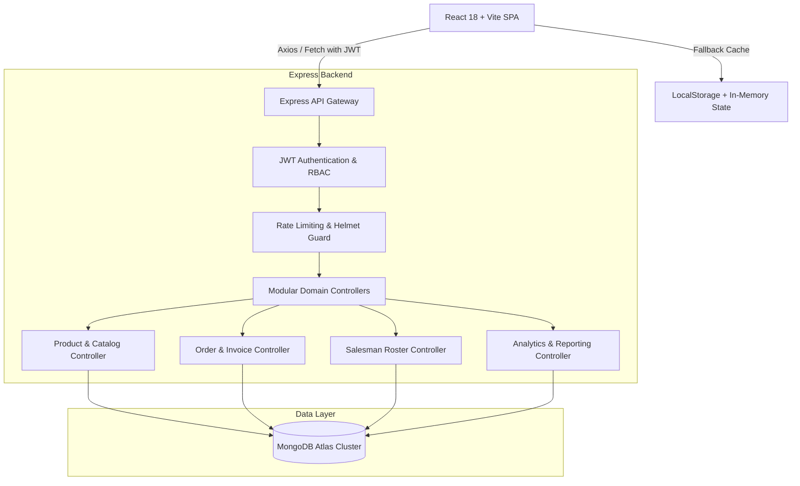

# ANUJ ENTERPRISES — ARCHITECTURE AUDIT REPORT
**Phase 8 Architecture Stabilization & Verification**

---

## 1. System Architecture Overview

The Anuj Enterprises platform is architected as a modern, high-resilience **Hybrid B2B E-Commerce & Distribution Application** designed for high throughput, mobile-field responsiveness, and failover survivability.

---

## 2. Architectural Audit Findings

### A. Frontend Layer (React 18 + Vite)
* **Design Pattern:** Context API state management (`AppContext.jsx`) with centralized business operations and optimistic UI updates.
* **Component Modularity:** Strict separation of concerns across functional domains (`catalogue`, `cart`, `admin`, `salesman`, `detail`, `home`, `common`).
* **Offline & Network Resilience:** Progressive data hydration. The app boots instantly from client cache and asynchronously synchronizes with the MongoDB REST API backend.
* **Bundle & Asset Optimization:** Vite production build generates chunked, minified ES modules with CSS extraction (`58.23 kB CSS`, `898 kB JS bundle` inclusive of Three.js and Lucide icons).

### B. Backend API Gateway (Node.js + Express + TypeScript)
* **Type Safety:** 100% TypeScript compilation (`npx tsc`) with strict typing across models, interfaces, and request/response payloads.
* **Security Hardening:** Helmet protection against header exploits, CORS whitelisting, and IP-based rate limiting (300 requests / 15 minutes).
* **Graceful SPA Routing:** Catch-all static route serving the production React bundle for non-API paths, enabling single-port production deployments.

### C. Database & Persistence Layer (MongoDB Atlas + Mongoose)
* **Schema Integrity:** Strict Mongoose schemas with indexed fields (`sku`, `productId`, `salesmanId`, `orderId`, `email`).
* **Concurrency Safety:** Atomic stock decrements during checkout using `Product.findOneAndUpdate({ _id, stock: { $gte: qty } }, { $inc: { stock: -qty } })` prevents race condition overselling.
* **Stock Restoration:** Cancelling orders automatically replenishes stock quantities in inventory.

---

## 3. Architecture Health Assessment

| Dimension | Rating | Status | Notes |
| :--- | :--- | :--- | :--- |
| **Separation of Concerns** | ⭐⭐⭐⭐⭐ | **Optimal** | Clean separation of frontend UI, state context, API clients, and backend controllers. |
| **Failover Survivability** | ⭐⭐⭐⭐⭐ | **Optimal** | LocalStorage + fallback initial data protects the UI from total failure if network is interrupted. |
| **Maintainability** | ⭐⭐⭐⭐⭐ | **Optimal** | Clear TypeScript types and modular controller files. |
| **Scalability** | ⭐⭐⭐⭐☆ | **Good** | Stateless JWT authentication allows horizontal API scaling behind load balancers. |
