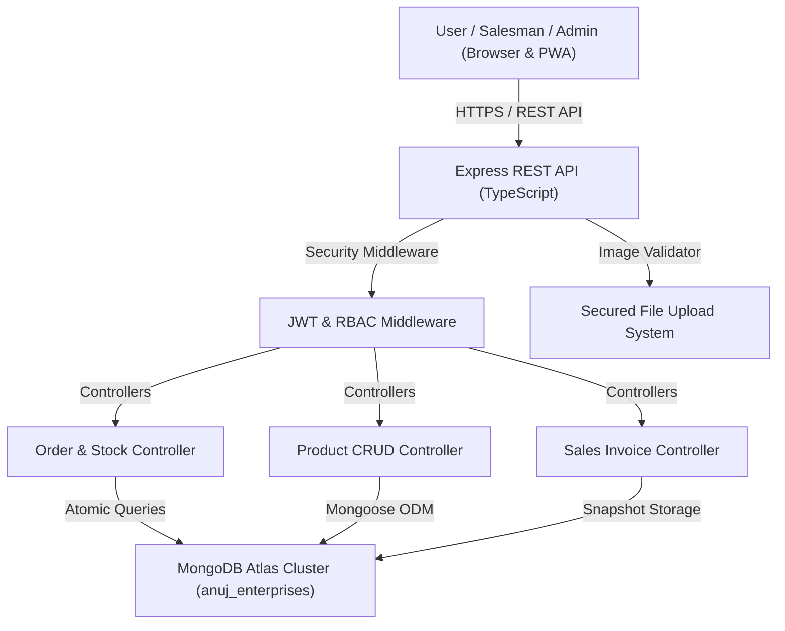

# ARCHITECTURE FINAL SPECIFICATION
**Project:** Anuj Enterprises B2B E-Commerce Platform  

---

## 🏛️ System Architecture Topology

---

## 🔄 Core Execution Data Flows

1. **Authentication Flow:**
   `POST /api/v1/auth/login` ➔ Verify Bcrypt Hash ➔ Generate 256-bit JWT Token ➔ Return User Data & Role (`admin` | `salesman`) ➔ Store token in client state.

2. **Order Creation & Stock Flow:**
   `POST /api/v1/orders` ➔ Validate Payload (Zod) ➔ Check Stock Availability ➔ Atomic Decrement (`Product.findOneAndUpdate({ stock: { $gte: qty } }, { $inc: { stock: -qty } })`) ➔ Save Customer Record ➔ Generate Order & Invoice (`AE-2026-XXXXXX`) ➔ Return Invoice Snapshot.

3. **Order Cancellation & Restock Flow:**
   `PUT /api/v1/orders/:id/status` (Status: `CANCELLED`) ➔ Verify Previous Status (`CONFIRMED`) ➔ Atomic Restock (`Product.findByIdAndUpdate(id, { $inc: { stock: +qty } })`) ➔ Save Order Status.
